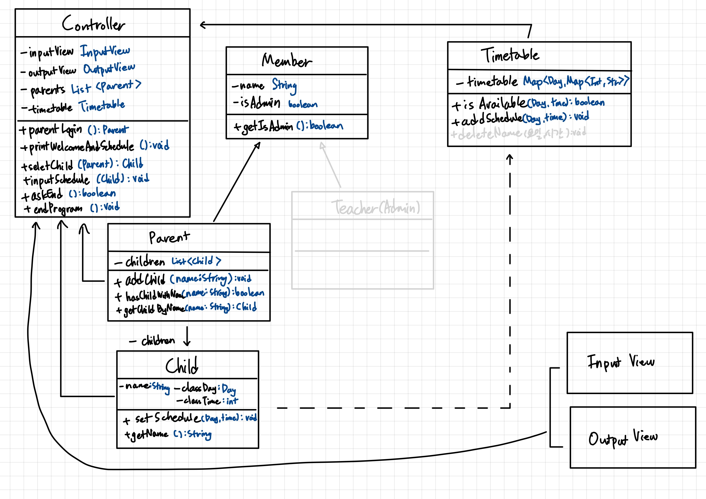

# 1주차 CLI 과제 - 시간표

## 주제

학원의 시간표에 자녀를 직접 등록하는 프로그램입니다.

> 어머니가 피아노 학원을 하시는데 시간표 때문에 매 학기 힘들어하시는 모습을 보고 생각해보게 되었습니다.
> 
> 시간표를 학부모가 쉽게 등록할 수 있으면, 어머니와 학부모님들 모두 편해지실 것 같아 간단하게라도 제작해보게 되었습니다.

## 기능 구현 목록

1. 학부모 이름 입력받기 (`학부모 성함을 적어주세요.`)
    - 학부모 이름이 없는 경우 회원가입 (`현재 00학원의 회원이 아니십니다. 회원가입 하시겠습니까? (y/n)`)
        - y -> 자녀 이름 입력받기 (`학부모의 자녀로 등록할 아이(들)의 이름을 적어주세요. (ex. jiye, nix)`, 쉼표 기준으로 5명까지 받을 수 있음)
        - n -> 프로그램 종료
2. 현재 시간표를 보여준다.
      ```
            MON      TUE     WED     THU     FRI
      -------------------------------------------
      1시 |          jiye
      2시 |                          helen
      3시 | 
      4시 | rosy
      5시 | 
    
      ```
3. 자녀 이름 입력 받기 (`시간표를 등록할 아이의 이름을 적어주세요.`)
   - 아이 이름이 학부모 멤버에 등록되어 있지 않은 경우 (`아이가 현재 등록되어 있지 않습니다. 등록하시겠습니까? (y/n)`)
     - y -> 자녀 이름 입력받기 (`등록할 자녀의 이름을 입력해주세요. (ex. jiye, nix)`)
     - n -> 자녀 이름 다시 받기 (`자녀의 이름을 다시 입력해주세요.`)
4. 원하는 시간대 입력 받기 (`원하시는 요일과 시간을 올바른 형식으로 입력해주세요 (ex. 월-3시)`)
   - 원하는 시간대에 이미 이름이 있는 경우, Error 발생 후 재입력
5. 시간대에 학생 이름을 적은 후 프로그램 종료할건지 물어보기 (y/n)
---
- 모든 이름은 영어로 5글자 이하만 가능
  - 형식 어긋난 경우, `Error` 발생 후 재입력 (`영어로 5자 이하만 가능합니다. ex. lee`)

### 확장 가능성

- 관리자인지 물어보고, 관리자의 경우 시간표 수정도 가능하도록...

## 클래스 다이어그램

